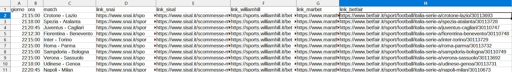
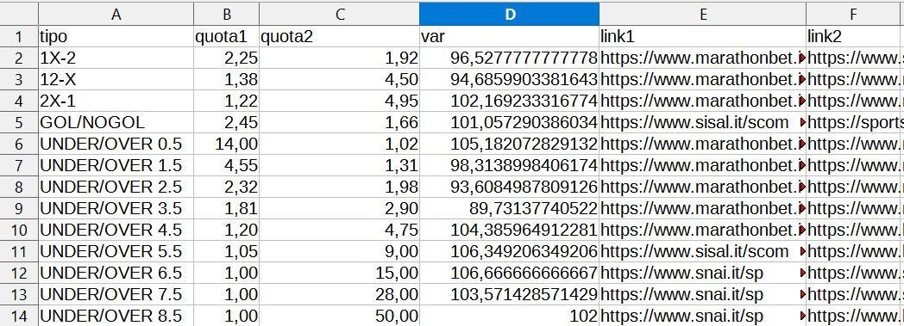

# SureBetFinder by Mast
:uk: This readme will be in Italian since the program is developed to communicate with Italian betting sites and could not work with accounts of non-Italian citizens.

:it: Questo readme sarà in italiano dal momento che il programma è sviluppato per comunicare con siti di scommesse italiani e non potrebbe funzionare con account di cittadini non italiani.

## Librerie usate
#### Già incluse in python 3.8
* webbrowser
* os.path
* datetime
#### Non incluse (pip install name)
* pandas
* bs4
* request_html

## Introduzione
Ho sviluppato questo programma per 2 motivi differenti:
1. prendere confidenza con lo scraping e la manipolazione dei dati con pandas.
2. individuare le "SUREBET", cioè le differenze di quota presenti tra i vari bookmaker che garantiscono una vincità sicura ad ogni scommessa.

Ci tengo a specificare che non ho mai sfruttato questo codice per guadagnare in quanto non lo ritengo etico, ed è per questa ragione che il codice qui presente è una versione deprecata e incompleta che non permette di individuare le Surebet senza impegno. 
Ho deciso di condividere il codice __[(sotto questa licenza)](https://github.com/simonemastella/surebetfinder/blob/main/LICENSE)__ solo per scopi educativi, dunque per facilitare lo studio delle varie librerie e (funzioni) fornendo un esempio funzionante (provvederò a commentare il codice appena ne avrò la possibilità).

## Descrizione funzionamento Step-by-Step
* all'avvio ti chiederà di scegliere uno tra 16 campionati
  - nel caso in cui tu abbia già scaricato la lista delle partite di quel campionato ti proporrà di utilizzare quella lista salvata in locale, in caso contrario provvederà a scaricarla e salvarla.
  - in ogni caso, prima o poi, la lista delle partite dovrà essere scaricata e inserita in un DataFrame. Ecco i passaggi per scaricare la lista delle partite:
    + inizierà a scrappare la lista delle partite del campionato selezionato dal primo all'ultimo sito di scommesse (non async per evitare conflitti)
    + ogni sito mostra una quantità differente di partite in base a quanti giorni mancano all'incontro, quindi prenderà il sito con il minor numero di partite e inizierà a popolare la partita con i link dei vari siti che contengono le quote che ci interessano
    + qui si presenta un'altra complicazione, ossia che i vari bookmaker chiamano le squadre in modo diverso ('Club Atlético de Madrid', 'Atletico', ' Atlético de Madrid') per ovviare al problema verrà lanciata una query in base al giorno e orario dell'incontro e saranno giudicate in base a una proporzione di somiglianza calcolato da una funzione
* a questo punto visualizzerai a schermo la lista degli incontri e potrai scegliere di cercare le surebet su tutti i match o su uno solo (le surebet prese in considerazione saranno [1x:2, 12:x, 2x:1, g:ng, uo0.5, uo1.5, uo2.5, uo3.5, uo4.5, uo5.5, uo6.5, uo7.5, uo8.5])
  - per ogni tipo di surebet possibile verrà controllato il valore maggiore per entrambi i casi e in base a quello sarà calcolato il margine di profitto
  - ogni partita alla fine di questi calcoli verrà salvata in un file csv per facilitarne la lettura finale
  
## Risultato
  
Questa è la lista degli incontri che contiene i link dei match
 
Nella colonna var troviamo il guadagno garantito dalla scommessa
Se il valore è minore di 100 significa che è una surebet, al diminuire di var aumenterà il profitto
Ad esempio con 100 euro nel caso under over 3.5 farei un profitto di 10,2€
Per avere più dettagli ci basta inserire le 2 quote nel programma __[quantoPunto.py](https://github.com/simonemastella/surebetfinder/quantoPunto.py)__
